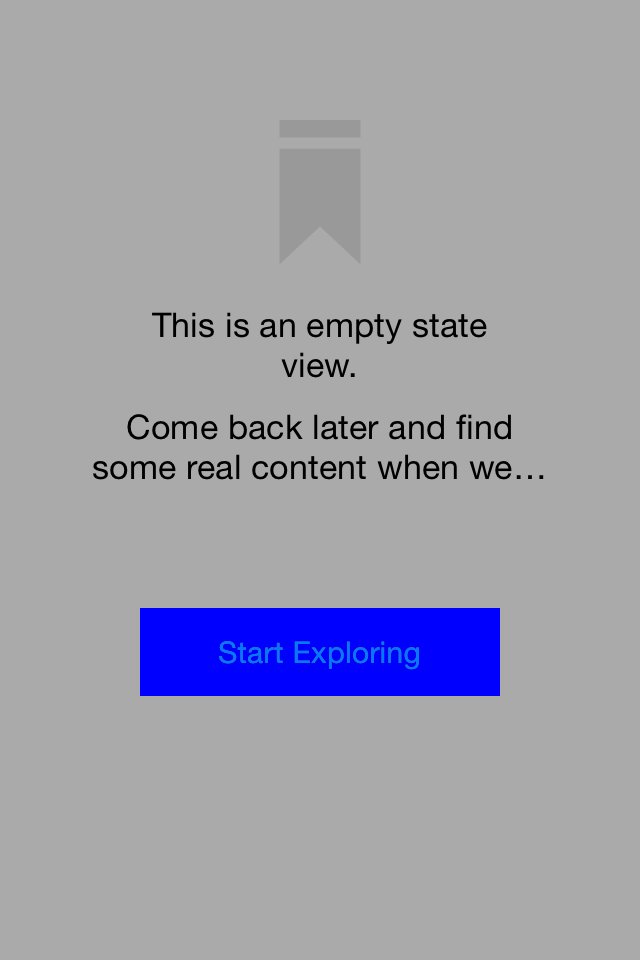
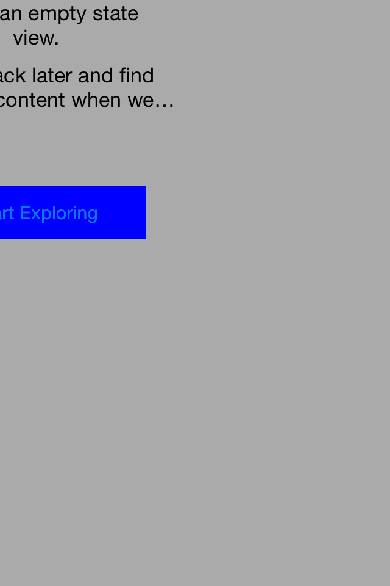

# SnapshotLayerFailingTestCase
Failing test case example when rendering as layer for ios-snapshot-test-case

This is to demonstrate layout bugs when using the `renderAsLayer` approach. Unfortunately, as a result, we've only been able to rely on iOS7 to run snapshot tests.

# Render As Layer Disabled

# Render As Layer Enabled

